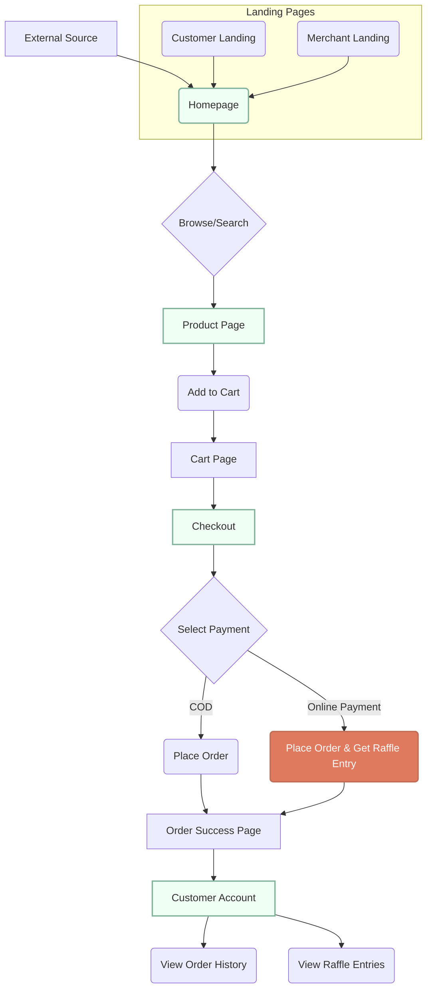
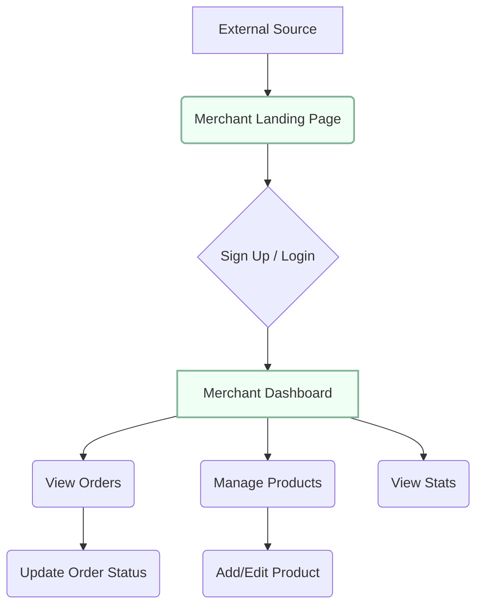

# Amadeo Marketplace: Navigation Flow

This document outlines the primary navigation paths for the two main user types on the Amadeo Marketplace platform: **Customers** and **Merchants**.

---

## 1. Customer Journey

The customer journey is designed to be a seamless funnel from discovery to purchase and repeat engagement.

### Key Customer Pages:

| Page | URL | Purpose |
| :--- | :--- | :--- |
| **Homepage** | `/index.html` | Discover stores and products. Main entry point. |
| **Product Page** | (Dynamic) | View product details, images, and merchant info. |
| **Cart** | (Modal) | Review items, adjust quantity. |
| **Checkout** | (Modal) | Enter delivery info, select payment method. |
| **Customer Account** | `/account.html` | Track orders, view raffle entries, manage info. |
| **Customer Landing** | `/customer-landing.html` | Attract new customers with value propositions. |

---

## 2. Merchant Journey

The merchant journey is focused on easy onboarding, store management, and order fulfillment.

### Key Merchant Pages:

| Page | URL | Purpose |
| :--- | :--- | :--- |
| **Merchant Landing** | `/merchant-landing.html` | Convince businesses to join the platform. |
| **Merchant Login** | `/merchant-login.html` | Secure access to the dashboard. |
| **Merchant Dashboard** | `/dashboard.html` | Central hub for managing store, products, and orders. |

---

## 3. Sitemap & Page Connections

This shows how all the pages are interconnected.

*   **Homepage (`/`)**
    *   Links to Product Pages.
    *   Links to Customer Account (`/account.html`).
    *   Footer links to Merchant Landing (`/merchant-landing.html`) and Customer Landing (`/customer-landing.html`).
*   **Merchant Landing (`/merchant-landing.html`)**
    *   Primary CTA links to Merchant Login/Sign Up (`/merchant-login.html`).
*   **Customer Landing (`/customer-landing.html`)**
    *   Primary CTA links to the Homepage (`/`).
*   **Merchant Dashboard (`/dashboard.html`)**
    *   Self-contained with tabs for Orders, Products, etc.
*   **Customer Account (`/account.html`)**
    *   Accessible after placing an order or via direct link.
